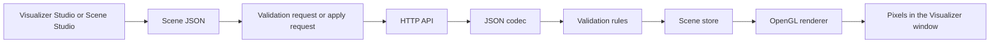

# Chapter 3: Follow One Scene

This chapter is the heart of the walkthrough.

Instead of talking about the project in categories, we will follow one scene
all the way from idea to pixels.

## The short visual version

## Step 1: A tool creates or edits scene data

The scene usually starts in one of two places:

- Visualizer Studio
- Scene Studio

Both tools help produce a scene description, but they are not the final
renderer.

They are scene *authors* and scene *operators*.

## Step 2: The scene is represented as JSON

Before the renderer can draw anything, the scene has to exist in a structured
format.

In Halcyn, that format is JSON.

Why JSON?

Because it is:

- human-readable
- easy to generate from Python and JavaScript
- easy to inspect in logs and tests
- a natural fit for HTTP APIs

## Step 3: The scene can be validated before it is applied

This is one of the safest design choices in the project.

The operator tools can ask:

"Is this scene valid?"

without also asking:

"Please replace the active scene right now."

That means the project separates:

- **checking** a scene
- **activating** a scene

## Step 4: The HTTP API receives the scene

Once a scene is submitted, the API layer inside the native Visualizer receives
it.

This is handled by the code in `src/http_api`.

At this point, Halcyn is no longer dealing with "UI controls" or "which button
you pressed." It is dealing with a structured request.

## Step 5: The JSON codec parses the payload

The JSON codec translates raw JSON text into the project's internal scene
structures.

This is where you move from:

- text on the wire

to:

- actual scene objects the program understands

## Step 6: Validation rejects bad scenes

If the scene is malformed, inconsistent, oversized, or otherwise invalid, the
validation layer rejects it.

That protects:

- the renderer
- the current active scene
- the operator

## Step 7: The scene store becomes the source of truth

If the new scene is valid and applied, the scene store keeps it as the latest
active scene.

The renderer does not ask the UI what to draw next. It asks the scene store.

## Step 8: The renderer uploads the scene to the GPU

Now the `src/opengl_renderer` layer turns scene data into OpenGL work.

That means:

- preparing buffers
- choosing shaders
- configuring draw state
- issuing draw calls

## Step 9: The window shows the result

Finally, the Visualizer window displays the current scene.

At that point, the full path has been:

1. UI or tool interaction
2. JSON generation
3. optional validation
4. HTTP request
5. parsing
6. validation
7. scene storage
8. GPU upload and draw
9. pixels

## Where the bar-wall scenes fit into this story

Bar-wall scenes are not a separate renderer anymore.

They are simply one scene family that reaches the same renderer through the
same general path.

The difference is in how the scene is *constructed* before it reaches the API.

## Try this now

With the workbench open:

1. Make a small scene change in Visualizer Studio.
2. Preview it first.
3. Validate it.
4. Apply it.
5. Watch the Activity Monitor while you do that.

That one tiny exercise makes the whole pipeline much less abstract.

## Formal references for this chapter

- [API reference](https://gedrocht.github.io/Halcyn/api.html)
- [Architecture guide](https://gedrocht.github.io/Halcyn/architecture.html)
- [Field reference](https://gedrocht.github.io/Halcyn/field-reference.html)

## Helpful external references

- [JSON in Python](https://docs.python.org/3/library/json.html)
- [nlohmann/json API](https://nlohmann.github.io/json/api/basic_json/)
- [cpp-httplib repository](https://github.com/yhirose/cpp-httplib)
- [OpenGL Wiki](https://wikis.khronos.org/opengl/Main_Page)

- Walkthrough index: [Return to the walkthrough index](index.md)
- Previous chapter: [Chapter 2: Meet the Cast](02-meet-the-cast.md)
- Next chapter: [Chapter 4: Scene JSON Without Fear](04-scene-json-without-fear.md)
